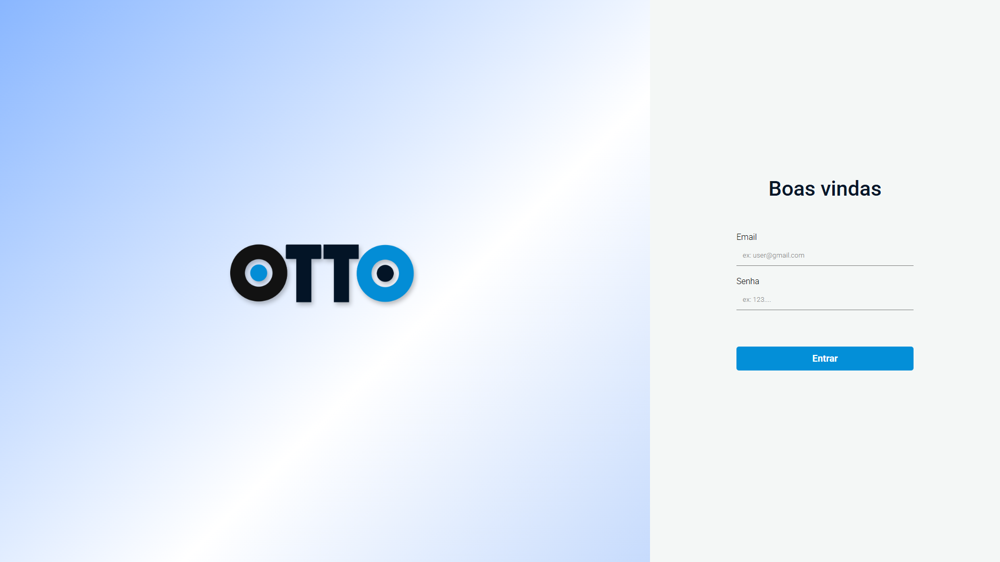
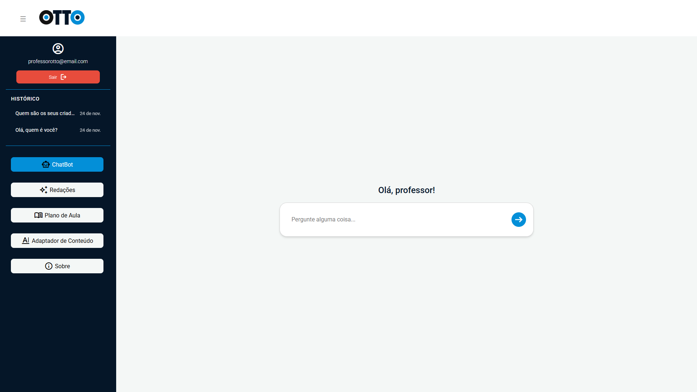
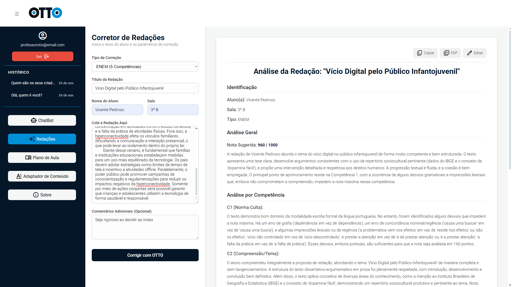
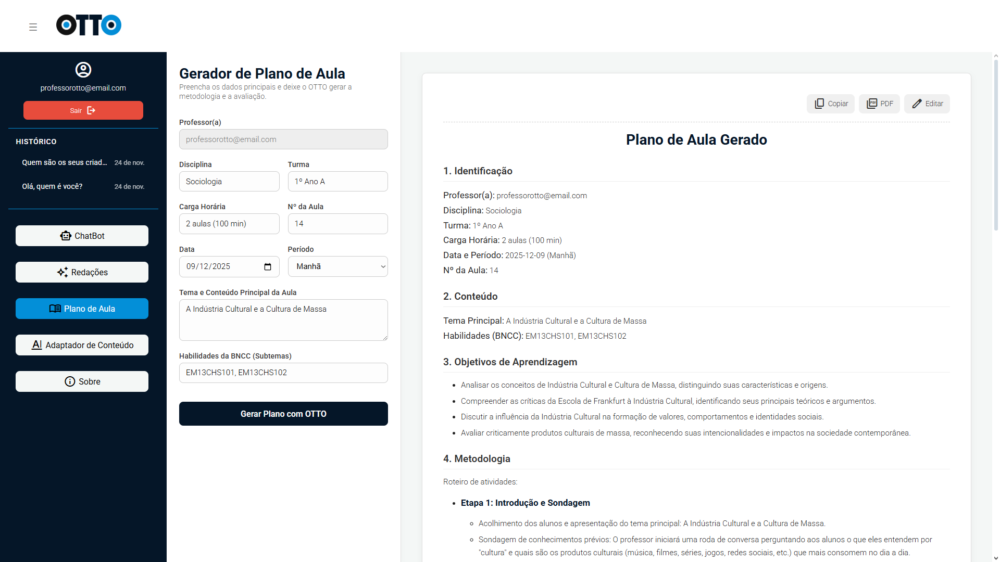
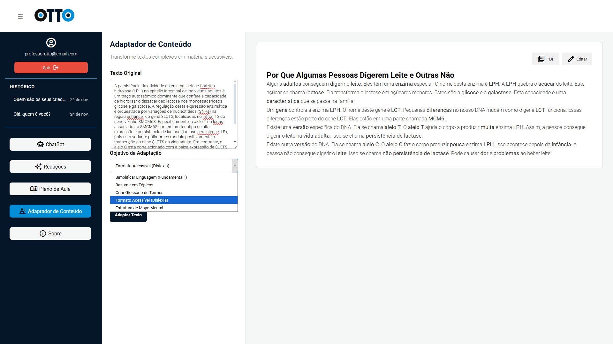
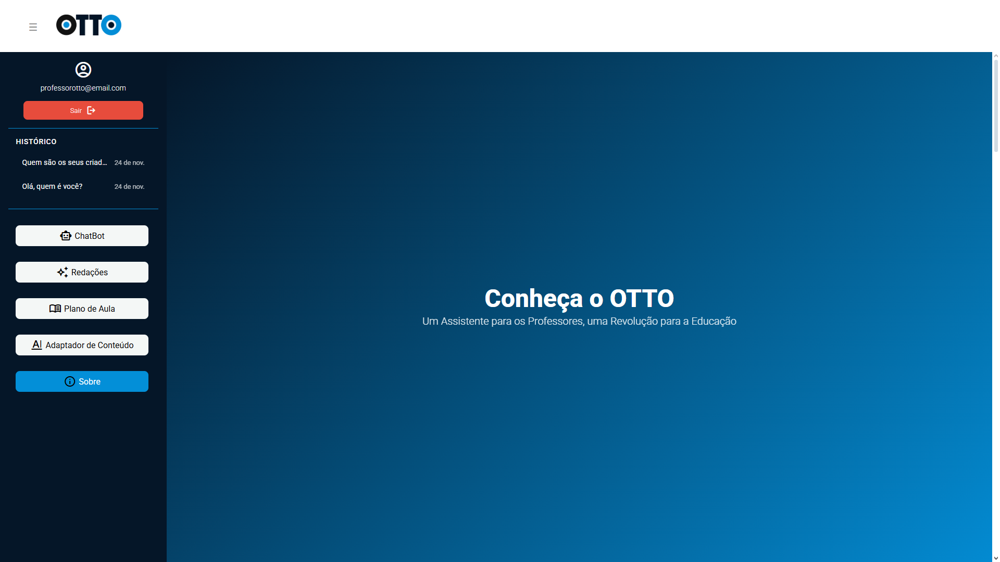

# OTTO - Um assistente para professores, uma revolução para a educação

---

> **Trabalho de Conclusão de Curso** — Técnico em Desenvolvimento de Sistemas integrado ao Ensino Médio — **ETEC de Hortolândia, 2025**  
> Orientação: Prof. Priscila Batista Martins

---

## Sobre o Projeto

[**Assista um pitch sobre o projeto**](https://youtu.be/zmzvQPjzUSs?si=NwREw9gygy0esaBw)

[**Back-end em Python do projeto**](https://github.com/vimathss/OTTO-BACK-END)

[**Assistente de Voz do projeto**]()

O **OTTO** é uma ferramenta baseada em inteligência artificial desenvolvida para apoiar professores em todas as fases do processo educacional, incluindo:  

- **Pré-aula** (preparação, planejamento, organização)  
- **Durante a aula** (tarefas pontuais, dinâmicas, interações)  
- **Pós-aula** (relatórios, feedbacks, análises)

O projeto integra um chatbot de inteligência artificial generativa, capaz de responder perguntas, esclarecer dúvidas e executar comandos programados para facilitar o cotidiano pedagógico e organizacional do professor.  
O software conta com uma interface desenvolvida em **React com TypeScript** e um **backend em Python**, incorporando bibliotecas especializadas no desenvolvimento de agentes de IA.

Além disso, o **OTTO** possui um robô físico baseado no **ESP32-S3-Korvo-1**, ideal para reconhecimento de voz, possibilitando interação por comandos falados e tirando respostas de dúvidas pontuais. 

## Principais Telas do Projeto

- **Tela de Login**: autenticação de professores

- **Tela de Principal**: página inicial e chat principal

- **Tela de Conversa**: chat de uma conversa antiga salva no histórico

- **Tela de Correção de Redação**: função de correção de redação com IA

- **Tela de Geração de Plano de Aula**: função de geração de planos de aulas com IA

- **Tela de Adaptação de Conteúdo**: função de adaptação de textos com IA

- **Tela de Sobre**: página sobre o nosso projeto e equipe

## Tecnologias utilizadas no Front-end
- React + TypeScript (interface)
- Firebase Authentication (Backend-as-a-Service para autenticação)
- Firebase FireStore (Backend-as-a-Service para dados de histórico)
- Figma e Canva (ilustração da interface)

## Conquistas com o OTTO
- Melhor Projeto oriundo da Região **Sudeste** do Brasil na **FEBIC 2025 – Joinville/SC** 🏅  
- Medalha de **OURO** na **EXPOTEC 2025 – Leme/SP** 🏅
- 2º lugar **Melhor Projeto** do Curso Técnico em Desenvolvimento de Sistemas na **PROJETEC 2025 - Hortolândia/SP** 🥈 
- Participação em diversas feiras e desafios, como o Solve For Tomorrow Brasil e o Desafio Liga Jovem

## Informações adicionais
- Status: **Concluido e Apresentado (com possibilidades de continuidade)**  
- Ano: **2025**

## Autores

- **Cristiano Secco Júnior**
- **Daniel Ayron de Oliveira**
- **Paulo Eduardo Ferreira Junior**
- **Vicente Matheus Collin Pedroso**  

